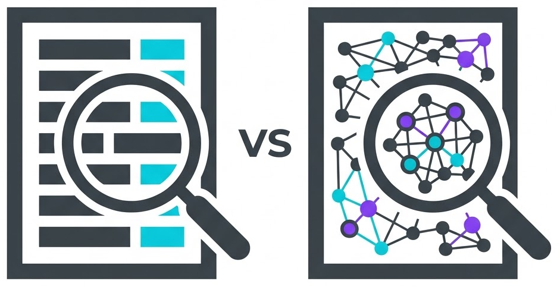

# GraphRAG vs. Standard RAG



This repository contains a performance benchmark comparing **Standard RAG (Vector Search)** against **GraphRAG (Knowledge Graph)**. The objective is to demonstrate how standard vector retrieval models break down when facing multi-hop relational dependencies embedded within high-density noise, while GraphRAG resolves the structural pathways deterministically.

- [🗺️ The PoC Scenario: Digital Chain of Custody](#-the-poc-scenario-digital-chain-of-custody)
- [🪤 The Adversarial Blind-Spot Strategy](#-the-adversarial-blind-spot-strategy)
- [️⚙️ Project Setup](# -project-setup)
- [🚀 Execution](#-execution)
- [🔬 Post-Mortem & Core Findings](#-post-mortem--core-findings)
- [📊 Strategic Evaluation Matrix](#-strategic-evaluation-matrix)

## 🗺️ The PoC Scenario: Digital Chain of Custody

This benchmark uses an **Asset Lineage (Provenance Chain)** tracking environment. A high-clearance security asset passes through several hands before deployment. The names of the origin person and the final destination target never appear in the same document.

### The True Structural Pathway

The asset's true journey is split across three separate, highly structured operational data-logs:

$$\text{Arthur (System Engineer)} \xrightarrow{\text{001}} \text{Beatrice (Validator)} \xrightarrow{\text{002}} \text{Charlie (Operator)} \xrightarrow{\text{003}} \text{Diana (DBA)}$$

* **File 1 ([`input_001.txt`](input/input_001.txt)):** Arthur generates a high-clearance security key token and transfers it to Beatrice.
* **File 2 ([`input_002.txt`](input/input_002.txt)):** Beatrice validates the security key token and forwards it to Charlie.
* **File 3 ([`input_003.txt`](input/input_003.txt)):** Charlie executes final deployment and uploads the incoming security key token directly into Diana's database cluster.

## 🪤 The Adversarial Blind-Spot Strategy

Standard vector search engines easily solve multi-hop questions if the target phrase is unique. To expose the architectural limitations of flat semantic searches, this environment deploys an **Adversarial Noise Flood** consisting of **200 highly structured data files**:

1. **Universal Keyword Saturation:** Every single one of the 200 generated files explicitly contains the exact phrase `"security key token"`. This completely blinds standard vector indexing by destroying it as a unique keyword identifier.
2. **High-Density Vector Baits:** Four explicit decoy records specifically target Diana and the phrase "database cluster" (e.g., Diana requesting token lanyards, or other technicians assigning tokens to different coffee machine database clusters).
3. **Procedural Noise:** 193 data logs tracking irrelevant office hand-offs (e.g., folders, spreadsheets, and keycard rosters) between unrelated personnel.

### The Target Query

```text
Identify the original creator of the security key token that was ultimately uploaded into Diana's database cluster.
```

## ⚙️ Project Setup

This project requires [**uv**](https://docs.astral.sh/uv/getting-started/installation/) and **make**.

GraphRAG project was created using:
```shell
uv run graphrag init
```

And GraphRAG default chunking configuration in [`settings.yaml`](settings.yaml) was reduced in size in order to make differences between RAG and GraphRAG more evident, as we are using a small dataset:
```yaml
chunking:
  type: tokens
  size: 150
  overlap: 30
  encoding_model: o200k_base
```

Set your model provider in [`settings.yaml`](settings.yaml) under `completion_models` and `embedding_models`. This PoC was executed using **gemini**.

Also, if required, copy [`.env.example`](.env.example) to `.env` and provide your model provider API key under `GRAPHRAG_API_KEY`.

More information about GraphRAG configuration at [microsoft.github.io/graphrag/config/yaml](https://microsoft.github.io/graphrag/config/yaml/).

Run `make` to see all available commands.

## 🚀 Execution

The environment is built procedurally using an automated script to format both signal files and background noise identically. This ensures that GraphRAG treats all source text with equal extraction priority during indexation.

### Step 1: Generate the Dataset

```shell
make generate
```

### Step 2: Run GraphRAG indexation

```shell
make index
```

> Note: step 1 and 2 can be executed at once using `make all`

### Step 3: Run the Queries

```shell
make query-basic QUERY="Identify the original creator of the security key token that was ultimately uploaded into Diana's database cluster"
make query-local QUERY="Identify the original creator of the security key token that was ultimately uploaded into Diana's database cluster"
```

## 🔬 Post-Mortem & Core Findings

### 🏳️ Standard RAG Defeat

Standard RAG searches purely via surface-level cosine similarity. Because every background file contains the term "security key token," it cannot use those words to filter out data. The query forces it to anchor on "Diana's database cluster," successfully pulling [`input_003.txt`](input/input_003.txt) (Charlie $\rightarrow$ Diana) and the 4 target decoy baits.

However, [`input_001.txt`](input/input_001.txt) (Arthur $\rightarrow$ Beatrice) has **zero semantic correlation** to Diana. It gets pushed completely out of the Top-K retrieval window. Standard RAG stops at the terminal end of the chain, failing the multi-hop requirements entirely and explicitly concluding:

> *"The available data tables do not contain sufficient information to identify the original creator... the source or creator of that specific token is not documented in the provided logs."*

Check the complete [RAG result here](results/result-rag.md)

### 🏆 GraphRAG Victory

GraphRAG completely bypasses the keyword trap. During indexation, its entity extraction pipeline maps the structured components into explicit graph edges. At query execution, the engine roots into the **Diana** node, discovers the inbound relationship from **Charlie** ([`input_003.txt`](input/input_003.txt)), hops backward to **Beatrice** ([`input_002.txt`](input/input_002.txt)), and traces the operational lineage directly back to **Arthur** ([`input_001.txt`](input/input_001.txt)). It isolates the signal completely, returning a flawless audit summary with zero noise leakage.

Check the complete [GraphRAG result here](results/result-graphrag.md)

### ⚠️ Prompt Sensitivity and Vector Drifting in Small Datasets

In small-scale or highly localized data environments, Standard RAG exhibits extreme sensitivity to semantic variations in the query. Because the embedding space is tightly packed, adding or altering minor phrasing shifts the query's vector coordinates just enough to pull completely different document chunks into the top retrieval window.

> **The Fluke Factor:** This spatial drifting means that a simple prompt variation can inadvertently cause Standard RAG to "succeed" by accidentally bringing the missing relational chunks into the context window. However, returning to the baseline query or making another minor adjustment will cause it to relapse into data-insufficiency.

This behavioral volatility underscores the inherent **brittleness and non-deterministic nature** of raw vector similarity search. Conversely, GraphRAG remains **100% deterministic**; it navigates hardwired topological pathways rather than relying on shifting coordinate distances, delivering identical, reliable lineage results regardless of how the query is phrased.

## 📊 Strategic Evaluation Matrix

| Evaluation Vector | Standard RAG (`basic`) | GraphRAG (`local`) |
| --- | --- | --- |
| **Data Structure** | Flat text chunks (Unaware of connections). | Relational network (Pre-mapped dependencies). |
| **Multi-Hop Traversal** | **Failed.** Blocked if intermediate steps lack query keywords. | **Passed.** Tracks multi-step lineage across distinct files. |
| **Noise Resistance** | **Zero.** Vulnerable to keyword saturation and term exploitation. | **Absolute.** Filters out peripheral entities via graph topology. |
| **Determinism** | **Brittle.** Results shift unpredictably with minor prompt changes. | **Stable.** Reliant on static, pre-computed graph edges. |
| **Cost Profile** | Fast, low latency, near-zero indexing costs. | Heavy build time, high token consumption costs. |

> **Architectural Rule of Thumb:** Use **Standard RAG** when optimizing for cost and speed to find *where a specific concept is written*. Upgrade to **GraphRAG** when your business requires tracing *how separate pieces of hidden information are structurally connected to each other*.

Happy AI coding! 💙
